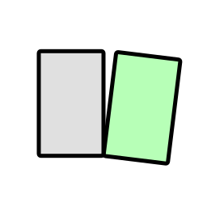

# Inspector


[](LICENSE)

[](https://tauri.app/)
[](https://www.rust-lang.org/)
[](https://reactjs.org/)
[](https://github.com/ericceg/inspector/releases/latest)


<p align="center">
   
</p>


**Lightweight photo reviewer for fast Tinder-style culling with a locked zoom.** Open a folder, zoom into the detail you care about, then move through the set without resetting the view.
Do the whole selection process just using the keyboard while Inspector sorts files into `pick`, `hold`, and `reject` folders in real time.

## Installation

Download the latest prebuilt app for macOS, Windows, or Linux from the [GitHub releases page](https://github.com/ericceg/inspector/releases/latest).


On macOS you'll need to remove the quarantine flag after installation, otherwise macOS may report the app as corrupted:

```bash
sudo xattr -dr com.apple.quarantine /Applications/Inspector.app
```


## Why I Made This

When I am reviewing a shoot, I usually care about a very specific region: eyes in a portrait, sharpness on a product edge, motion blur in a hand, or whether two nearly identical frames differ in some small way.

Most photo browsers make that comparison awkward. You zoom in, move to the next image, and lose the exact crop you were checking.

Inspector is built around one idea:

- **Keep the zoom and framing locked** while moving through a folder
- **Cull quickly** with simple pick/hold/reject decisions
- **Compare adjacent frames** without changing your place
- **Stay local** by reviewing directly from a folder on disk


## Supported Files

Directly viewable formats:

- `jpg`, `jpeg`, `png`, `tif`, `tiff`, `webp`, `gif`, `avif`, `heic`, `heif`, `bmp`

RAW formats:

- `cr2`, `cr3`, `nef`, `nrw`, `arw`, `sr2`, `orf`, `rw2`, `raf`, `dng`, `pef`, `raw`

Inspector runs on macOS, Windows, and Linux through Tauri. RAW preview generation is currently implemented on **macOS** using system tools.

## Keyboard Shortcuts

| Shortcut | Action |
|----------|--------|
| `O` | Open folder |
| `←` / `H` / `K` | Previous frame |
| `→` / `J` / `L` | Next frame |
| `1` | Pick |
| `2` | Hold |
| `3` | Reject |
| `Backspace` | Reject |
| `U` | Clear current decision |
| `+` / `-` | Zoom in / out |
| `0` | Reset zoom and pan |

## Development

### Prerequisites

- Node.js
- Rust
- Tauri prerequisites for your platform: [tauri.app/start/prerequisites](https://tauri.app/start/prerequisites/)

### Run Locally

```bash
npm install
npm run tauri dev
```

### Build

```bash
npm run tauri build
```

## Notes

- Ratings are persisted immediately by moving files inside the loaded folder.
- Reopening a folder that already contains `pick`, `hold`, or `reject` subfolders restores those ratings automatically so you can continue later.
- Clearing a rating moves the file back out of the decision folders into the loaded folder tree.
- Nested folder structure is preserved underneath `pick`, `hold`, and `reject`.
- RAW preview generation is implemented on macOS; other platforms can still review browser-viewable image formats.
- Preview JPEGs for RAW files are cached under your system temp directory.

## License

MIT. See [LICENSE](LICENSE).
